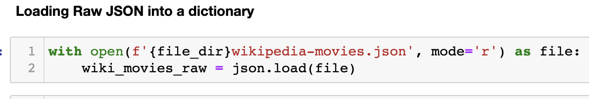
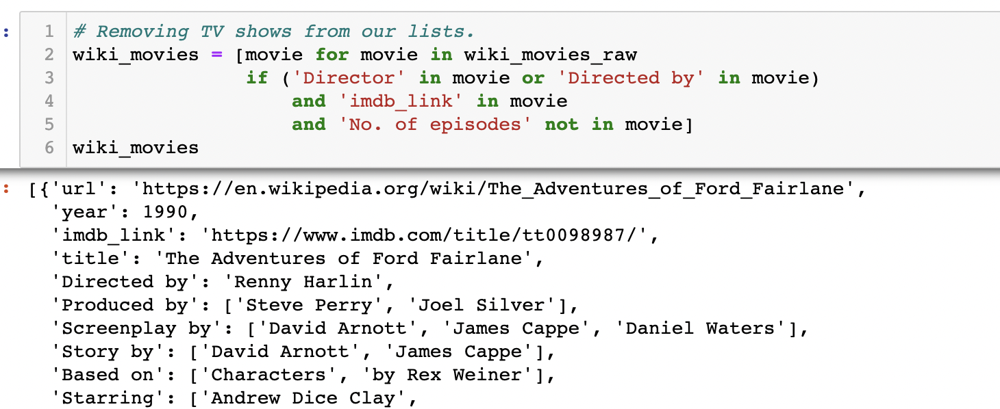
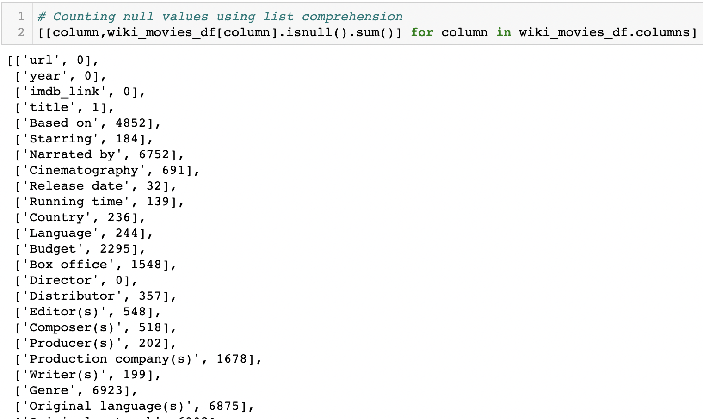
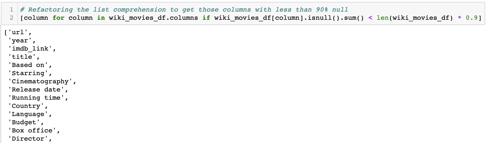
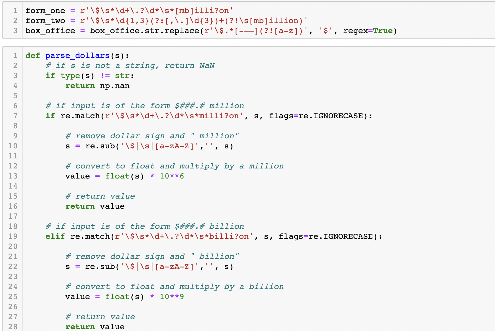
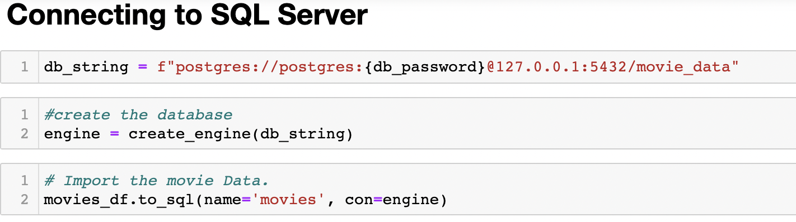
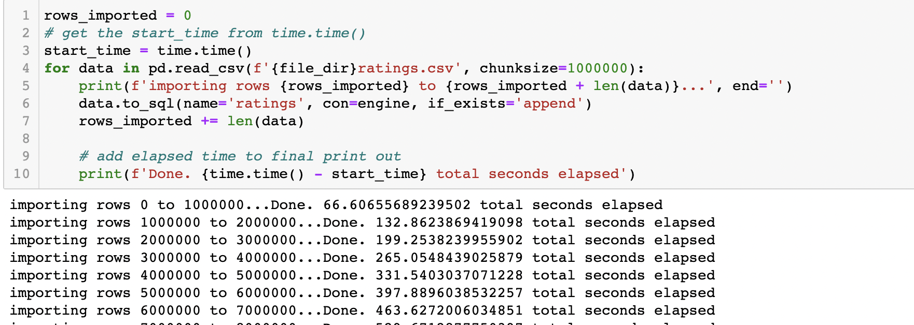

# Movies-ETL

## Background

<<<<<<< HEAD
The purpose of this project was to create a database of movies and ratings, with the purpose of eventually developing an algorithim that would predict the performance of future low budget films. Before the analysis could be performed, I had to develop a data pipeline inorder to transfer the data from its current database(s) into a new database.

In order to successfully create the data pipeline, I utilized the ETL process to collect raw data from various sources, transform the data and load it into an SQL database. The ETL process is used to ensure that data remains consistent, and maintains integrety. With the power of python and pandas, I automized data wrangling task in order to prepare the data for future analysis. After the data was transformed with python, I uploaded that data into a post-gres SQL database. 

For the following sections below, I will be walking you through some of the key steps taken in this lengthy ETL process.

## Extract

The data utilized for this process came from 2 different sources, a Wikipedia dataset and 2 datasets from the Kaggle movie database. The wikipedia dataset was in a json format, and the kaggle data was in a csv format.

- I was able to extract my data from both sources without the use of an api, however since both files are in different formats, different methods were required to import the data into my notebook.

  - My json file from Wikipedia was imported using a "with" statement inorder to first open my dataset and the **json.load()** function was later used to save my data file into a new variable. 
    - 

- My csv files were saved to my notebook with the standard **pd.read_csv** function.

## Transform

The transform step of the ETL process is by far the most extensive of the other 2 steps. The transform process is unique because it contains an iterative process within it, and that is the "inspect plan and execute" process. This stage of the process was very extensive, but for the sake of time, I will highlight some of the key transformations that I performed.

The Wikipedia dataset contained a few tv shows, so I utilized the list comprehension method in order to filter the dataset. The criteria that was met by all movies was an imbd rating, a director, and no value for number of tv episodes.

A common issue with raw data is an excess of null values, in order to inspect the state of the dataframe, I used the list comprehension method in order to count the amount of null values for every column.

With some columns having such a high amount of null values, the next function was used to find columns with 90% or more real values.
- 
  - This list was past later passed into a variable, and that variable was then used to create a new dataframe.

One the most difficult parts of this transformation process were the different formats contained within the box office column. Since the box office column contained data showing revenue, there were a few different formats used to report the figures.
- In order to capture and transform the data, I used regular expressions to parse the data and convert the captured values into one standard format.
  - 

This etl process contained many more iterations, if you are curious to view some more please check out the **"ETL.ipynb"** file within the repository.

## Load

After I created my database in sql, I created a connection string in my python notebook as a link to my server. With the use of sqlAclchemy, I created an engine and passed my string variable into it in order to properly connect to my local sql server and eventualy load some data into the database. 

Since the ratings data was so large the data had to be loaded into the database in chuncks. In order to load the data as chunks, the **chunksize=** parameter was used to add 1-million rows of data at a time. To keep track of all this data, some functionality was added to the standard export code in order to keep track of rows exported, and count time elapsed.

=======
In this project, I will be creating an ETL pipeline that will transform raw data into an SQL database. Python will be used to extract the data from their sources, I will be scraping data from wikipedia for all movies released after the year 1990, and movie ratings data from the movie lands website hosted by kaggle. With the power of pandas, I was able to load the data into a dataframe in order to clean and transform the data. With the use of regular expressions through python, I was also able load my data into SQL from my jupyter notebook.
>>>>>>> 95ededbbe04e3e5e2d487f19b45bc1c2c51ef4e5
